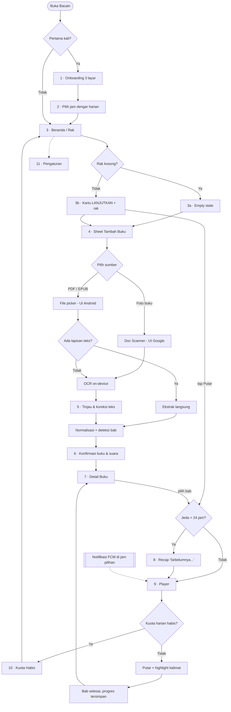

# Rencana: Bacain — App Pembaca Buku AI (MVP)

## Context

Repo `stuwagapat/bacain` saat ini kosong (hanya `README.md` + `riset-app-pembaca-buku-ai.md`). Dokumen riset itu memvalidasi sebuah masalah bertumpuk: minat baca Indonesia rendah, preferensi mendengarkan sangat tinggi (Indonesia peringkat 1 dunia untuk proporsi pendengar podcast), fenomena tsundoku, dan attention span menurun. Idenya: ubah buku milik user sendiri — PDF, EPUB, atau foto buku fisik — menjadi narasi audio AI Bahasa Indonesia.

Wawasan kunci dari dokumen (bagian 7): kekuatan terbesar bukan memilih antara "app audiobook AI" atau "chunking harian", melainkan **menjadikan chunking sebagai mekanik inti di dalam app audiobook**. Rencana ini dibangun di atas premis itu.

Dua temuan dari fase diskusi yang membentuk rencana ini:

1. **Memfoto satu buku utuh (±250 jepretan) itu tidak realistis.** Chunking menyelamatkannya: user cukup scan satu bab untuk jatah dengar hari itu. Scan jadi ritual kecil, bukan kerja rodi di awal.
2. **Ekonomi biaya jauh lebih longgar dari dugaan awal.** Google Cloud TTS **WaveNet = $4/1jt karakter dengan 4jt char/bulan gratis** (bukan $16 seperti asumsi awal). Kuota gratis itu menampung ±285 user-hari penuh/bulan — cukup membiayai seluruh fase validasi tanpa keluar uang.

**Hasil yang diinginkan:** APK Android yang bisa dibagikan ke 20–50 penguji, cukup lengkap untuk menjawab pertanyaan sebenarnya — *apakah orang benar-benar menyelesaikan buku dengan cara ini?*

### Urutan eksekusi

**Langkah pertama yang dikerjakan sekarang hanyalah kerangka design token di Figma** — struktur Variables (warna terang & gelap, spasi, radius) dan Text Styles dengan seluruh nama token yang dibutuhkan kode, berisi nilai placeholder abu-abu. User mengisi nilainya.

Coding aplikasi (Fase 0 dan seterusnya) **belum dimulai** sampai ada aba-aba terpisah.

### Keputusan yang sudah diambil

| Keputusan | Pilihan |
|---|---|
| Pintu masuk konten | PDF/EPUB **dan** scan buku fisik, keduanya di MVP |
| Model biaya | Gratis + kuota harian ±15 menit audio/user |
| Stack | Flutter, Android-first |
| Posisi hak cipta | Longgar dulu, dirapikan setelah ada user nyata |
| Ringkasan "sebelumnya..." | Masuk MVP (Claude Haiku) |
| Highlight teks | Versi sederhana (per kalimat, berbasis perkiraan durasi) |
| Autentikasi | Anonim dulu, login Google belakangan |
| Ritme drip | Lembut — kuota jadi pembatas alami, tanpa gerbang terkunci |
| Pembagian peran | Claude menulis kode; user memegang produk, desain & identitas visual |
| Identitas visual | Disusun user menyusul — wireframe di bawah sengaja netral (struktur & hierarki saja) |

---

## Desain: Alur Layar

Wireframe di bawah hanya menetapkan **struktur, hierarki, dan urutan** — bukan gaya visual. Warna, tipografi, ilustrasi, ikon, dan motion diserahkan sepenuhnya ke desain.

**Dua layar tidak perlu didesain** karena disediakan sistem: layar kamera scan (UI bawaan Google ML Kit Document Scanner — deteksi sudut, crop, mode batch) dan file picker Android.



---

## Wireframe per Layar

### 1 · Onboarding (3 layar geser)

Auth anonim jalan diam-diam di latar belakang — user tidak pernah melihat layar login.

```
┌────────────────────────────┐   Layar 1: janji produk
│                            │   Layar 2: cara kerja (3 ikon)
│                            │   Layar 3: → lihat no. 2
│       [ ilustrasi ]        │
│                            │   Nada tulisan: hangat, personal.
│                            │   Hindari bahasa tool produktivitas
│  Buku yang menumpuk,       │   ("optimalkan", "produktif").
│  akhirnya kebaca.          │
│                            │
│  Foto bukumu, dengarkan    │
│  satu bab tiap hari.       │
│                            │
│         ● ○ ○              │
│  ┌──────────────────────┐  │
│  │        Lanjut        │  │
│  └──────────────────────┘  │
│          Lewati            │
└────────────────────────────┘
```

### 2 · Pilih jam dengar harian

Satu-satunya pertanyaan di onboarding. Sesuai bagian 5.2 dokumen riset: jangan menumpuk keputusan di awal.

```
┌────────────────────────────┐
│  ←                         │
│                            │
│  Kapan kamu mau dengar?    │
│                            │
│  Kami ingatkan sekali      │
│  sehari, di jam ini.       │
│                            │
│      ┌──────────────┐      │
│      │   07 : 00    │      │   time picker
│      └──────────────┘      │
│                            │
│  [ pagi ][ siang ][ malam ]│   preset cepat
│                            │
│  Bisa diubah kapan saja.   │
│                            │
│  ┌──────────────────────┐  │
│  │       Selesai        │  │
│  └──────────────────────┘  │
└────────────────────────────┘
```

### 3a · Beranda — rak kosong

Layar paling menentukan. Ini yang dilihat 100% user baru, dan tempat sebagian besar dari mereka memutuskan berhenti atau lanjut.

```
┌────────────────────────────┐
│  Bacain               ⚙    │
│                            │
│                            │
│      [ ilustrasi rak       │
│         kosong ]           │
│                            │
│   Raknya masih kosong      │
│                            │
│   Mulai dari buku yang     │
│   paling lama kamu tunda.  │
│                            │
│  ┌──────────────────────┐  │
│  │  📷  Foto buku fisik │  │
│  └──────────────────────┘  │
│  ┌──────────────────────┐  │
│  │  📄  Pilih file      │  │
│  └──────────────────────┘  │
│                            │
└────────────────────────────┘
```

### 3b · Beranda — terisi

```
┌────────────────────────────┐
│  Bacain               ⚙    │
│                            │
│  Sisa hari ini    18 menit │  ← kuota, bahasa menit
│  ▓▓▓▓▓▓▓▓▓▓▓░░░░░░░        │     bukan karakter
│                            │
│ ┌────────────────────────┐ │
│ │ LANJUTKAN              │ │  ← satu aksi jelas,
│ │ ┌────┐                 │ │     tanpa perlu memilih
│ │ │ ▓▓ │ Filosofi Teras  │ │
│ │ │ ▓▓ │ Bab 4 · 14 menit│ │
│ │ └────┘                 │ │
│ │ ▓▓▓▓▓▓░░░░░░ 38%       │ │
│ │            ┌─────────┐ │ │
│ │            │ ▶ Putar │ │ │
│ │            └─────────┘ │ │
│ └────────────────────────┘ │
│                            │
│  Rak kamu                  │
│  ┌────┐  ┌────┐  ┌────┐    │
│  │ ▓▓ │  │ ▓▓ │  │  +  │   │
│  └────┘  └────┘  └────┘    │
│  Atomic  Sapiens  Tambah   │
│   12%      0%              │
│                            │
├────────────────────────────┤
│ ▓ Filosofi Teras   ▶   ⌃  │  ← mini player, menempel
└────────────────────────────┘     di semua layar utama
```

### 4 · Tambah buku (bottom sheet)

```
┌────────────────────────────┐
│                            │
│     ( beranda meredup )    │
│                            │
│ ╭──────────────────────────╮
│ │          ────            │
│ │  Tambah buku             │
│ │                          │
│ │  📷  Foto buku fisik     │
│ │      Scan per halaman    │
│ │  ──────────────────────  │
│ │  📄  Pilih file          │
│ │      PDF atau EPUB       │
│ │  ──────────────────────  │
│ │  📖  Cerita rakyat       │
│ │      Gratis · segera     │  ← placeholder,
│ ╰──────────────────────────╯     belum aktif di MVP
└────────────────────────────┘
```

### 5 · Tinjau hasil scan

OCR takkan pernah 100% akurat. Layar ini adalah pengakuan jujur atas itu — beri user jalan keluar, jangan berpura-pura sempurna.

```
┌────────────────────────────┐
│  ←  Periksa hasil    12 hal│
│                            │
│  ◀  ┌──────────────────┐ ▶ │  ← geser antar halaman
│     │                  │   │
│     │  [ foto halaman ]│   │
│     │                  │   │
│     └──────────────────┘   │
│        Halaman 3 dari 12   │
│                            │
│  ┌──────────────────────┐  │
│  │ Manusia adalah       │  │  ← teks hasil OCR,
│  │ makhluk sosial yang  │  │     bisa diketik ulang
│  │ tidak bisa hidup     │  │
│  │ sendiri...        ✎  │  │
│  └──────────────────────┘  │
│  ⚠ 2 kata mungkin keliru   │  ← dari skor keyakinan
│                            │     ML Kit
│  🗑 Hapus halaman ini      │
│                            │
│  ┌──────────────────────┐  │
│  │        Lanjut        │  │
│  └──────────────────────┘  │
└────────────────────────────┘
```

### 6 · Konfirmasi buku & pilih suara

Baris **"± 18 hari dengar"** adalah momen paling penting di seluruh app: di sinilah user pertama kali memahami bahwa ini serial harian, bukan file audio raksasa.

```
┌────────────────────────────┐
│  ←  Buku baru              │
│                            │
│  Judul                     │
│  ┌──────────────────────┐  │
│  │ Filosofi Teras       │  │  ← tebakan otomatis,
│  └──────────────────────┘  │     bisa diedit
│                            │
│  ┌──────────────────────┐  │
│  │  12 bab ditemukan    │  │
│  │  ± 4 jam 20 menit    │  │
│  │  ± 18 hari dengar    │  │  ← inti gagasan drip
│  └──────────────────────┘  │
│  ▸ Lihat & koreksi bab     │
│                            │
│  Suara pembaca             │
│  ┌──────────────────────┐  │
│  │ ● Ayu   perempuan  ▷ │  │  ← ▷ = cicip suara
│  │ ○ Bima  laki-laki  ▷ │  │
│  └──────────────────────┘  │
│                            │
│  ┌──────────────────────┐  │
│  │   Masukkan ke rak    │  │
│  └──────────────────────┘  │
└────────────────────────────┘
```

### 7 · Detail buku

```
┌────────────────────────────┐
│  ←                    ⋮    │
│                            │
│  ┌────┐  Filosofi Teras    │
│  │ ▓▓ │  Henry Manampiring │
│  │ ▓▓ │  12 bab · 4j 20m   │
│  └────┘                    │
│                            │
│  ▓▓▓▓▓▓░░░░░░░░░░  38%     │
│                            │
│  ┌──────────────────────┐  │
│  │  ▶  Dengarkan Bab 4  │  │
│  └──────────────────────┘  │
│                            │
│  Daftar bab                │
│  ✓ 1  Sebuah Undangan  12m │  ✓ sudah didengar
│  ✓ 2  Sekelumit Filsafat13m│
│  ✓ 3  Hidup Selaras    15m │
│  ● 4  Dikotomi Kendali 14m │  ● siap diputar
│  ○ 5  Memperjelas Nilai 16m│  ○ belum disintesis
│  ○ 6  Hidup Berkebajikan   │
│  ○ 7  ...                  │
│                            │
├────────────────────────────┤
│ ▓ Filosofi Teras   ▶   ⌃  │
└────────────────────────────┘
```

### 8 · Recap "Sebelumnya..."

Muncul **hanya bila jeda sesi terakhir >24 jam**. Kalau user sedang mendengarkan berturut-turut, layar ini justru mengganggu dan harus dilewati sepenuhnya. Teks langsung ikut disuarakan begitu layar terbuka.

```
┌────────────────────────────┐
│  ✕                         │
│                            │
│                            │
│      Sebelumnya...         │
│                            │
│   Di bab lalu, penulis     │
│   memperkenalkan gagasan   │
│   bahwa sebagian hal ada   │
│   di bawah kendali kita,   │
│   sebagian lagi tidak.     │
│                            │
│           ◗))              │  ← indikator audio jalan
│                            │
│  ┌──────────────────────┐  │
│  │   Lanjut ke Bab 4    │  │
│  └──────────────────────┘  │
│          Lewati            │
└────────────────────────────┘
```

### 9 · Player — layar inti

Area teks berjalan mengambil porsi terbesar. Inilah yang membedakan Bacain dari pemutar audio biasa, sekaligus menjawab fitur 5.3 di dokumen riset (bantu fokus & aksesibilitas disleksia).

```
┌────────────────────────────┐
│  ⌄         Bab 4       ⋮   │
│       Dikotomi Kendali     │
│                            │
│  ┌──────────────────────┐  │
│  │ ...beberapa hal ada  │  │  teks pudar = sudah lewat
│  │ dalam kendali kita.  │  │
│  │                      │  │
│  │ ▐Sebagian lagi tidak│  │  ← kalimat aktif
│  │ ▐sama sekali.       │  │     (highlight, auto-scroll)
│  │                      │  │
│  │ Kegelisahan lahir    │  │  teks normal = belum
│  │ ketika kita mencoba  │  │
│  │ mengendalikan yang   │  │
│  │ bukan urusan kita.   │  │
│  └──────────────────────┘  │
│                            │
│  ────────●─────────────    │
│  6:12               14:03  │
│                            │
│    ↺15    ┌──────┐   ↻15   │
│           │  ▮▮  │         │
│           └──────┘         │
│                            │
│  1.0×     🔊 Ayu    18m    │  ← sisa kuota, diam saja
└────────────────────────────┘
```

**Mode fokus** (tap area teks — layar meredup, cocok untuk di jalan/mata istirahat):

```
┌────────────────────────────┐
│                            │
│                            │
│      Filosofi Teras        │
│      Bab 4                 │
│                            │
│   Sebagian lagi tidak      │  ← hanya kalimat aktif
│   sama sekali.             │
│                            │
│                            │
│    ↺15     ▮▮     ↻15      │
│  ────────●─────────────    │
│                            │
└────────────────────────────┘
```

### 10 · Kuota harian habis

Harus terasa seperti garis finis, bukan tembok. Nada tulisan: memberi selamat, bukan menghalangi.

**Penting:** mendengar ulang bab yang sudah pernah disintesis **tidak memakan kuota** — MP3-nya sudah ada, tidak ada biaya baru. Jangan pernah dikunci.

```
┌────────────────────────────┐
│  ←                         │
│                            │
│       [ ilustrasi ]        │
│                            │
│   Jatah hari ini habis     │
│                            │
│   Kamu sudah dengar        │
│   32 menit hari ini.       │
│   Lumayan!                 │
│                            │
│   Bab 5 kami siapkan       │
│   besok jam 07.00.         │
│                            │
│  ┌──────────────────────┐  │
│  │ Dengar ulang bab lama│  │  ← selalu gratis
│  └──────────────────────┘  │
│           Tutup            │
└────────────────────────────┘
```

### 11 · Pengaturan

```
┌────────────────────────────┐
│  ←  Pengaturan             │
│                            │
│  KEBIASAAN                 │
│  Pengingat harian   07.00 >│
│  Notifikasi            ●   │
│                            │
│  SUARA                     │
│  Suara pembaca      Ayu   >│
│  Kecepatan          1.0×  >│
│                            │
│  PENYIMPANAN               │
│  Unduh otomatis        ●   │
│  Kelola unduhan    124 MB >│
│                            │
│  AKUN                      │
│  Amankan progres          >│  ← baru di sini
│  Masuk dengan Google        │     login ditawarkan
│                            │
│  Tentang Bacain           >│
└────────────────────────────┘
```

### Notifikasi harian

```
┌────────────────────────────┐
│ 🔔 Bacain            07.00 │
│ Bab 4 sudah siap           │
│ Dikotomi Kendali · 14 menit│
└────────────────────────────┘
```

Segmen di-prefetch di latar belakang menjelang jam ini, jadi begitu notifikasi ditekan audio langsung jalan tanpa menunggu sintesis.

---

## Arsitektur

```
Flutter (Android)                    Firebase (asia-southeast2)
─────────────────                    ──────────────────────────
Ingest                               Cloud Functions
 ├ PDF/EPUB  → file_picker            ├ synthesizeSegment  → Google TTS WaveNet id-ID
 ├ Scan      → ML Kit Doc Scanner     ├ generateRecap      → Claude Haiku 4.5
 └ OCR       → ML Kit Text Recog.     └ (keduanya menegakkan kuota)
      ↓
Normalisasi & segmentasi (on-device, gratis)
      ↓                              Firestore   → metadata buku, progres, kuota
Pemutar (just_audio + audio_service)  Storage    → MP3 per segmen, path per-user
      ↓                              Anon Auth   → identitas untuk kuota
Highlight kalimat + offline cache     FCM        → notifikasi harian
```

**Prinsip:** semua yang bisa gratis dikerjakan di HP. OCR (ML Kit, on-device, tanpa batas) dan segmentasi tidak memakan biaya sama sekali. **Satu-satunya tekanan biaya ada di TTS**, dan itu dijaga ketat di server.

### Kenapa TTS harus di server

API key Google Cloud tidak boleh ada di dalam APK — bisa diekstrak dan disalahgunakan. Cloud Function jadi satu-satunya jalur ke TTS, sekaligus tempat penegakan kuota.

---

## Rencana Implementasi

### Fase 0 — Fondasi

- Proyek Flutter, `minSdk 21`, paket `com.bacain.app`
- Firebase: Anonymous Auth, Firestore, Storage, Functions (region **asia-southeast2** / Jakarta untuk latensi), FCM
- Riverpod untuk state, Drift untuk penyimpanan lokal
- **Pengaman biaya (kerjakan di fase ini, bukan nanti):** dokumen `system/killswitch` di Firestore berisi pagu karakter harian global. Setiap Cloud Function membacanya sebelum memanggil TTS dan menolak bila terlampaui. Satu bug perulangan tanpa ini bisa menghabiskan tagihan dalam semalam.

**File:** `pubspec.yaml`, `lib/main.dart`, `lib/core/firebase/`, `functions/src/index.ts`, `firestore.rules`, `storage.rules`

### Fase 1 — Irisan vertikal: EPUB → audio (end-to-end)

Bangun satu jalur utuh dari file sampai suara sebelum melebar. EPUB duluan karena strukturnya sudah rapi (daftar isi eksplisit) — jadi segmentasinya jujur teruji tanpa tertutup masalah OCR.

**Ingest** (`lib/features/ingest/`)
- `epubx` → daftar bab + XHTML → teks polos

**Normalisasi** (`lib/features/segment/text_cleaner.dart`)
- Sambung kata terpenggal di akhir baris (`peng-\nhasilan` → `penghasilan`)
- Buang header/footer berulang (baris yang muncul di >60% halaman) dan nomor halaman
- Rapikan spasi & baris kosong berlebih

**Segmentasi** (`lib/features/segment/segmenter.dart`)
- Prioritas 1: batas bab dari daftar isi EPUB
- Prioritas 2: heuristik regex — `BAB\s+[IVXLC0-9]+`, `Bab\s+\w+`, `Chapter\s+\d+`
- Lalu pecah jadi target **±2.250 kata** (≈15 menit @150 wpm), selalu putus di batas paragraf, tidak pernah di tengah kalimat

**Sintesis** (`functions/src/synthesize.ts`)
- Transaksi Firestore pada `users/{uid}/quota/{YYYY-MM-DD}` — pagu **14.000 karakter/hari**
- Pecah teks jadi permintaan ≤5.000 byte (batas API Google TTS), gabungkan hasil MP3-nya
- Suara: `id-ID-Wavenet-A` (default), simpan pilihan suara di profil user
- Unggah ke `users/{uid}/books/{bookId}/segments/{n}.mp3`
- Kembalikan signed URL + tabel waktu kalimat (JSON)

**Voice engine pluggable** (`functions/src/tts/`) — antarmuka `TtsProvider` dengan implementasi `GoogleTtsProvider`. Dokumen riset menekankan ini di bagian 4, dan itu benar: migrasi ke Piper self-hosted nanti harus jadi penambahan satu file, bukan bedah ulang.

**Pemutar** (`lib/features/player/`)
- `just_audio` + `audio_service` — wajib, supaya audio jalan saat layar mati dan muncul kontrol di lockscreen. Tanpa ini app tidak terpakai di skenario nyatanya (di jalan, sambil beres-beres).

### Fase 2 — Scan buku fisik

Masuk ke pipeline Fase 1 di titik "Normalisasi" — jadi segmentasi, sintesis, dan pemutar tinggal dipakai ulang.

- `google_mlkit_document_scanner` — **mode batch multi-halaman**, deteksi sudut, auto-crop, koreksi perspektif, hapus jari & noda. Semua on-device, gratis, dan UI-nya sudah disediakan Google. Ini yang menjawab kritik #6 di dokumen riset tanpa kita menulis computer vision sendiri.
- `google_mlkit_text_recognition` per halaman hasil scan → gabung berurutan
- Layar tinjau: user bisa perbaiki teks hasil OCR sebelum disintesis. OCR takkan pernah 100% — beri user jalan keluar, jangan berpura-pura sempurna.
- Catatan: Document Scanner **Android-only**. Sesuai keputusan Android-first; kalau nanti ke iOS, bagian ini perlu pengganti.

### Fase 3 — PDF (dua jalur)

- Ada lapisan teks → ekstrak langsung (`syncfusion_flutter_pdf`, lisensi Community gratis untuk individu/perusahaan kecil; alternatif bila lisensinya mengganjal: `pdfrx`)
- Halaman menghasilkan <100 karakter → berarti PDF hasil pindaian → render halaman jadi gambar → lempar ke ML Kit OCR (jalur Fase 2)
- Deteksi per halaman, bukan per dokumen — banyak PDF campuran

### Fase 4 — Mekanik kebiasaan

**Ringkasan "sebelumnya..."** (`functions/src/recap.ts`)
- Claude Haiku 4.5, 2–3 kalimat Bahasa Indonesia, dari teks segmen sebelumnya
- **Hanya dibuat bila jeda sesi terakhir >24 jam** — kalau user sedang asyik mendengarkan berturut-turut, ringkasan justru mengganggu
- Disimpan di Firestore agar tak dibuat ulang; ikut disuarakan TTS (±300 char, dampak kuotanya kecil)

**Highlight kalimat** (`lib/features/player/sentence_sync.dart`)
- Pecah segmen jadi kalimat, alokasikan durasi proporsional terhadap jumlah karakter dibanding durasi MP3 sebenarnya
- Digerakkan oleh `position stream` dari `just_audio`
- Tidak presisi per kata — tapi memberi hampir seluruh manfaatnya (bantu fokus, aksesibilitas disleksia) tanpa mengunci kita ke SSML timepoints milik Google

**Ritme harian (lembut)**
- Notifikasi FCM di jam pilihan user: *"Bab 3 sudah siap didengarkan"*
- Prefetch segmen berikutnya di latar belakang menjelang jam itu
- **Tanpa gerbang terkunci** — kalau user sedang bersemangat, biarkan lanjut sampai kuota harian habis
- Kuota ditampilkan sebagai **"sisa 12 menit hari ini"**, bukan karakter. Batas yang terasa seperti ritme, bukan hukuman.
- Reset 00:00 WIB (zona waktu tetap untuk MVP)

**Offline** — unduh MP3 + tabel waktu ke penyimpanan lokal via Drift; segmen yang sudah diunduh bisa didengar tanpa koneksi.

**Progres pasif** — persentase buku selesai & total menit didengarkan. Sesuai bagian 5.2 dokumen: **tanpa streak, badge, atau leaderboard** di MVP.

---

## Catatan yang perlu dipegang

**Hak cipta.** Kamu memilih "longgar dulu", dan rencana ini menghormati itu — tidak ada pembatasan fitur tambahan. Satu hal yang kebetulan gratis dan tetap kulakukan: audio disimpan di path per-user (`users/{uid}/...`) dengan Security Rules yang membatasi baca ke pemiliknya. Itu memang bentuk implementasi paling alami, bukan kerja ekstra, tapi menjaga pintu tetap terbuka kalau nanti perlu diperketat. Tombol ekspor/share sengaja belum ada di MVP — menambahkannya nanti itu mudah, mencabutnya setelah user terbiasa itu sulit.

**Ekonomi biaya yang perlu diawasi.** Kuota gratis 4jt char/bulan ≈ 285 user-hari penuh. Di atas ±60 user aktif, biaya mulai muncul (±$0,50/user/bulan pada utilisasi wajar). Ambang untuk mulai memindahkan TTS ke Piper self-hosted: sekitar **$50/bulan**. Karena `TtsProvider` sudah pluggable sejak Fase 1, itu jadi pekerjaan sehari, bukan sebulan.

**Chirp 3 HD** ($30/1jt, 1jt gratis/bulan) disiapkan sebagai "suara premium" berjatah terbatas — cocok untuk konten kurasi cerita rakyat nanti. Belum dipakai di MVP.

**Yang sengaja tidak dibangun:** streak/badge/leaderboard, share klip audio, katalog terpusat, mode "baca bareng", dukungan iOS, sinkron highlight per kata.

---

## Yang Perlu Disiapkan dari Sisi Desain

Disusun berdasarkan urutan kebutuhan kode, bukan urutan kerja desain. **Tingkat 1 memblokir mulainya coding UI; sisanya bisa menyusul** dengan placeholder sementara.

Aturan umum serah terima: **kirim SVG master + spesifikasi, jangan ekspor per ukuran.** Semua turunan ukuran (mdpi→xxxhdpi, ikon Play Store, splash) aku yang urus dari vektornya.

### Tingkat 1 — Memblokir (dibutuhkan sebelum layar pertama ditulis)

**Palet warna — wajib light DAN dark.**
Dark mode di sini bukan pemanis: app ini didengarkan malam hari dan menjelang tidur. Peran warna yang aku butuhkan sebagai token:

| Kelompok | Token |
|---|---|
| Latar | `background`, `surface`, `surfaceVariant` |
| Merek | `primary`, `onPrimary`, `accent` |
| Teks | `textPrimary`, `textSecondary`, `textDisabled` |
| Status | `success`, `warning`, `error`, `outline` |
| **Khusus player** | `readingTextActive` (kalimat yang sedang dibaca), `readingHighlightBg`, `readingTextPast` (sudah lewat, pudar), `readingTextFuture` |
| **Khusus progres** | `progressFilled`, `progressTrack`, `quotaBar` |

Empat token player itu yang paling rewel: harus cukup kontras untuk membantu fokus, tapi tidak menyilaukan saat layar gelap di kamar. Kemungkinan besar butuh beberapa putaran uji di HP asli, bukan di monitor.

**Tipografi — dua typeface, peran berbeda.**
- **UI**: judul, tombol, label. Bebas.
- **Teks bacaan di player**: ini beda kebutuhan. Butuh x-height besar, terminal huruf jelas, dan `1 l I` / `0 O` mudah dibedakan. Kalau klaim "membantu disleksia" mau dipegang serius, pertimbangkan menyediakan **Atkinson Hyperlegible** (gratis, dirancang khusus untuk low vision) sebagai opsi yang bisa dipilih user di Pengaturan.
- ⚠️ **Lisensi**: font harus boleh di-*embed* dalam aplikasi. Google Fonts (OFL) aman. Typeface berbayar butuh lisensi app embedding terpisah — desktop license saja tidak cukup.
- Yang aku butuhkan: skala tipe lengkap (ukuran `sp`, line-height, letter-spacing, weight) untuk `display / headline / title / bodyLarge / body / label / caption`. `bodyLarge` = teks player, ukuran terbesar setelah judul.

**Skala dasar** — grid spasi (kelipatan 4 atau 8 dp), corner radius (mis. 8/16/24), tinggi elevasi/bayangan.

**Logo** — wordmark + logomark (ikon berdiri sendiri), SVG. Logomark dipakai di app icon, splash, dan ikon notifikasi.

### Tingkat 2 — Dibutuhkan sebelum APK dibagikan ke penguji

**App icon** — SVG master. Aku turunkan jadi adaptive icon Android (layer foreground + background + monochrome untuk Material You). Catatan desain: konten penting harus aman di dalam lingkaran tengah, karena Android memotong ikon jadi berbagai bentuk (bulat, kotak membulat, squircle) tergantung merek HP.

**Splash screen** — logomark + satu warna latar. Android 12+ punya API splash bawaan yang cuma menerima ikon tunggal di tengah, jadi tidak bisa komposisi bebas.

**Ikon notifikasi** — Android mewajibkan **siluet putih polos di atas transparan**, tanpa warna, tanpa gradien. Ini sering terlewat dan hasilnya jadi kotak abu-abu di status bar. Butuh versi khusus dari logomark.

**Set ikon UI** — bisa pakai Material Symbols (gratis, lengkap) atau custom. Kalau custom, yang dibutuhkan: kamera, dokumen, buku, play, pause, maju/mundur 15 detik, unduh, pengaturan, centang, edit, hapus, speaker, kecepatan.

**Sistem sampul buku otomatis** — ini masalah desain nyata yang gampang terlewat. **Buku hasil scan dan sebagian besar PDF tidak punya gambar sampul.** Rak akan penuh kotak kosong kalau tidak ditangani. Butuh sistem sampul yang dibangkitkan dari judul — misalnya 8 varian gradien/pola yang dipilih otomatis berdasarkan hash judul, plus aturan penempatan teks judulnya. Tanpa ini, layar 3b (beranda terisi) akan terlihat mati.

**Ilustrasi — 5 buah:**
1. Onboarding layar 1 (janji produk)
2. Onboarding layar 2 (cara kerja)
3. Rak kosong (layar 3a) — yang paling penting, dilihat 100% user baru
4. Kuota habis (layar 10) — nadanya merayakan, bukan menghalangi
5. Kondisi error / offline

SVG lebih disukai (bisa ikut tema terang-gelap, ukuran file kecil).

### Tingkat 3 — Motion (keunggulanmu, tapi paling akhir)

Ditaruh terakhir bukan karena tidak penting, tapi karena butuh UI yang sudah jalan untuk dipasangi.

Yang paling berdampak, urut dari yang tertinggi:
1. **Perpindahan highlight kalimat di player.** Yang paling sering dilihat user, dan paling gampang bikin pusing kalau kasar. Kemungkinan besar ini animasi kode (interpolasi warna + auto-scroll), bukan Lottie — jadi yang aku butuhkan darimu adalah **kurva easing dan durasinya**, bukan file.
2. **State menunggu sintesis TTS.** Bisa 10–30 detik. Ini animasi yang tugasnya membuat penantian terasa singkat — kandidat kuat untuk Lottie.
3. **Momen bab selesai.** Satu-satunya perayaan di app. Harus terasa cukup, tapi tidak menahan user.
4. Waveform audio di layar recap
5. Morph play ⇄ pause
6. Transisi kartu buku → detail buku (shared element)

**Format**: rekomendasiku **Lottie** (After Effects → Bodymovin), karena kemungkinan besar itu alur kerjamu.
⚠️ Batasan Lottie di Flutter yang harus kamu tahu sebelum menganimasi: **tidak ada efek layer AE, tidak ada blur, tidak ada 3D layer, tidak ada motion blur, hindari merge paths, dan expression harus di-bake dulu**. Blend mode dukungannya sebagian. Kalau animasi dirancang dengan efek AE, hasilnya akan hilang diam-diam saat diputar di app — dan itu baru ketahuan di akhir.

### Tingkat 4 — Nada bicara & teks

Ini bagian identitas juga, bukan pekerjaan terpisah. Dokumen risetmu (bagian 5.5) menyebut positioning "hangat, bukan tool produktivitas kaku" — dan itu hidup atau mati di pilihan katanya.

Yang perlu diputuskan:
- **Prinsip nada bicara** — 3–5 aturan singkat (mis. "sapa dengan 'kamu'", "jangan pernah menyalahkan user", "hindari kosakata produktivitas: optimalkan, efisien, target")
- **Nama suara TTS** — wireframe pakai "Ayu" dan "Bima" sebagai penampung sementara
- **Teks notifikasi harian — butuh 8–10 varian.** Ini titik sentuh paling berulang di seluruh produk. Kalimat yang sama tiap hari selama sebulan akan berubah jadi kebisingan yang dimatikan user.
- **Pesan error yang manusiawi** — OCR gagal terbaca, tidak ada koneksi, file rusak, kuota habis
- **Teks empty state** untuk layar 3a

### Tingkat 5 — Play Store (menjelang rilis)

Ikon 512×512, feature graphic 1024×500, 4–8 tangkapan layar, deskripsi pendek (80 karakter) & panjang.

### Batasan teknis yang mengikat semua desain

| Hal | Ketentuan |
|---|---|
| Artboard | 360 × 800 dp (baseline Android). Desain di 1× — satuannya dp, aku yang urus densitas |
| Mini player | Menutup **±64 dp** di bagian bawah semua layar utama — perhitungkan di setiap komposisi |
| Safe area | Status bar atas + gesture navigation bar bawah |
| Target sentuh | Minimal **48 × 48 dp** untuk semua elemen yang bisa ditekan |
| Kontras teks | Minimal **4,5:1** (WCAG AA). Wajib, bukan opsional — aksesibilitas adalah salah satu klaim produk ini |
| Penskalaan font | Tata letak harus tetap utuh saat ukuran font sistem dinaikkan sampai 200% — hindari tinggi yang dikunci mati |
| Dark mode | Setiap layar butuh dua versi. Tidak ada yang "cukup dibalik warnanya" |

### Kerangka Design Token (siap dipindahkan ke Figma Variables)

Struktur lengkap dengan **nama token final yang akan dipakai kode**. Semua nilai warna diisi abu-abu placeholder dengan tingkat terang berbeda, supaya hierarkinya tetap terbaca sebelum warna asli masuk. Tugas desain: mengganti nilainya, **bukan namanya** — nama token ini yang akan direferensikan di kode Flutter.

#### Koleksi `1. Primitives` — mode tunggal `Value`

Palet mentah. Tidak pernah dipakai langsung di komponen; hanya jadi sumber alias.

| Grup | Token |
|---|---|
| Netral | `neutral/0`, `50`, `100`, `200`, `300`, `400`, `500`, `600`, `700`, `800`, `900`, `1000` |
| Merek | `brand/100`, `300`, `500`, `700`, `900` |
| Aksen | `accent/100`, `300`, `500`, `700`, `900` |
| Status | `red/100`, `red/500`, `amber/100`, `amber/500`, `green/100`, `green/500` |
| Sampul otomatis | `cover/1` … `cover/8` |

`cover/1–8` adalah palet untuk sampul buku yang dibangkitkan otomatis (lihat Tingkat 2). Delapan warna yang harus tetap enak dilihat saat berjejer di rak.

#### Koleksi `2. Color` — mode `Light` dan `Dark`

Semua token di sini **alias ke Primitives**, tidak berisi nilai mentah. Ini yang membuat ganti tema jadi sekali kerja.

| Grup | Token | Scope Figma |
|---|---|---|
| Latar | `bg/base`, `bg/surface`, `bg/surfaceVariant`, `bg/scrim` | Frame fill, Shape fill |
| Merek | `brand/primary`, `brand/onPrimary`, `brand/accent` | Frame fill, Shape fill |
| Teks | `text/primary`, `text/secondary`, `text/disabled`, `text/onBrand` | Text fill |
| Garis | `border/default`, `border/strong` | Stroke |
| Status | `status/success`, `status/successBg`, `status/warning`, `status/warningBg`, `status/error`, `status/errorBg` | Frame fill, Text fill |
| **Bacaan (player)** | `reading/textPast`, `reading/textFuture`, `reading/textActive`, `reading/highlightBg` | Text fill, Shape fill |
| Progres | `progress/filled`, `progress/track`, `quota/filled`, `quota/track` | Shape fill |
| Player | `player/controlBg`, `player/controlIcon`, `player/miniBarBg` | Frame fill, Shape fill |

Empat token `reading/*` itu yang paling menentukan rasa produk — dan paling perlu diuji langsung di layar HP dalam gelap, bukan di monitor.

#### Koleksi `3. Spacing` — mode tunggal `Value`, scope `Gap` + `Width/Height` + padding

`space/0`=0 · `space/1`=4 · `space/2`=8 · `space/3`=12 · `space/4`=16 · `space/5`=24 · `space/6`=32 · `space/7`=48 · `space/8`=64

#### Koleksi `4. Radius` — mode tunggal `Value`, scope `Corner radius`

`radius/none`=0 · `radius/sm`=8 · `radius/md`=16 · `radius/lg`=24 · `radius/full`=999

#### Koleksi `5. Size` — mode tunggal `Value`, scope `Width/Height`

Nilai tetap yang dipakai bersama oleh desain dan kode:

`size/touchMin`=48 · `size/icon`=24 · `size/miniPlayer`=64 · `size/coverSm`=56 · `size/coverMd`=96 · `size/coverLg`=120

#### Text Styles (bukan Variables)

Placeholder typeface: **Inter** (pasti tersedia di Figma). Ganti dengan pilihanmu nanti — namanya tetap.

**Kelompok UI**

| Style | Ukuran / Line-height | Weight | Dipakai di |
|---|---|---|---|
| `UI/Display` | 32 / 40 | 700 | Judul onboarding |
| `UI/Headline` | 24 / 32 | 700 | Judul layar |
| `UI/Title` | 20 / 28 | 600 | Judul buku |
| `UI/TitleSmall` | 16 / 24 | 600 | Judul bab di daftar |
| `UI/Body` | 15 / 22 | 400 | Teks umum |
| `UI/BodySmall` | 13 / 18 | 400 | Keterangan sekunder |
| `UI/Label` | 14 / 20 | 600 | Teks tombol |
| `UI/Caption` | 12 / 16 | 400 | Durasi, metadata |

**Kelompok Bacaan** — line-height sengaja jauh lebih longgar (±1,65). Ini teks yang dibaca sambil mendengarkan selama 15 menit; kerapatan UI biasa terlalu sesak.

| Style | Ukuran / Line-height | Weight | Dipakai di |
|---|---|---|---|
| `Reading/Body` | 19 / 32 | 400 | Teks berjalan di player |
| `Reading/BodyLarge` | 22 / 36 | 400 | Opsi teks besar (aksesibilitas) |
| `Reading/ChapterTitle` | 24 / 32 | 600 | Judul bab di player |
| `Reading/Recap` | 18 / 30 | 400 | Layar "Sebelumnya..." |

### Format serah terima

Kalau kamu mendesain di **Figma**, aku bisa membaca file-nya langsung — token warna, skala tipe, komponen, dan spesifikasi tata letak — tanpa kamu perlu menulis ulang apa pun jadi dokumen. Itu jalur paling mulus: cukup pakai **Figma Variables** untuk warna & spasi dan **Text Styles** untuk tipografi, lalu beri aku akses file-nya.

Kalau bukan Figma: satu file JSON design token + folder aset SVG/Lottie sudah cukup.

---

## Verifikasi

1. **Unit test segmentasi** — beri EPUB & teks OCR contoh, pastikan potongan jatuh di batas bab/paragraf dan tidak pernah memotong kalimat. Ini bagian paling rawan diam-diam salah.
2. **Uji kuota** — panggil `synthesizeSegment` berulang sampai melewati 14.000 char, pastikan permintaan ke-N ditolak rapi dengan pesan yang bisa dibaca user, bukan crash. Uji juga killswitch global.
3. **Uji end-to-end di perangkat Android nyata:**
   - EPUB domain publik (mis. dari Project Gutenberg) → potong → dengar → tutup app → pastikan audio lanjut di latar belakang & muncul di lockscreen
   - Foto 10 halaman buku fisik sungguhan dengan pencahayaan biasa → periksa akurasi OCR → sintesis → dengar
   - PDF berlapis teks **dan** PDF hasil pindaian, pastikan kedua jalur terpilih otomatis dengan benar
   - Mode pesawat → segmen yang sudah diunduh tetap bisa diputar
4. **Uji ringkasan recap** — majukan waktu sesi terakhir >24 jam, pastikan recap muncul; dengarkan berturut-turut, pastikan recap **tidak** muncul.
5. **Periksa biaya nyata** — setelah sehari pemakaian, cocokkan penggunaan karakter di Google Cloud Console dengan angka di Firestore. Kalau meleset, penegakan kuotanya bocor.
6. **Build APK release**, bagikan ke 5 orang dulu sebelum melebar ke 20–50.

## Pertanyaan sebenarnya yang diuji

Bukan "apakah app-nya jalan", tapi: **dari 20–50 penguji, berapa yang masih mendengarkan di hari ke-7, dan berapa yang menyelesaikan satu buku utuh?** Itu angka yang menjawab keraguan terbesar di bagian 8 dokumen riset — dan rencana ini disusun agar angka itu bisa didapat semurah dan secepat mungkin.
